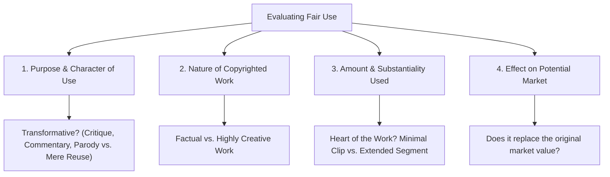

# Podcast Business & Legal Workshop: Ground-to-Launch Learning Plan

This learning plan is structured as an intensive, workshop-style training program based on the core curriculum of Gordon Firemark’s *Easy Legal for Podcasters* framework. It is designed to take a podcaster from amateur/hobbyist status to a fully protected, legally compliant, and monetization-ready media company.

---

## 📋 Course Overview & Workshop Objectives

### Workshop Philosophy
> **"Think like a pro, plan like a pro, act like a pro."**  
> Podcasting is media broadcasting. Operating without legal structures exposes creators to trademark disputes, collaborator fallout, breach of contract, and personal liability. This workshop provides actionable, step-by-step guidance to build legal armor and professional systems around your show.

### Key Outcomes
1. **Business Foundation**: Select and register the ideal legal entity (LLC/Corporation) with proper governance.
2. **Team & Guest Protections**: Formalize relationships with co-hosts, contractors, and guests using legal agreements.
3. **Intellectual Property Shield**: Register trademarks, protect copyrights, clear third-party content, and master Fair Use.
4. **Monetization & Contracts**: Negotiate sponsor deals, enforce FTC disclosures, and implement record-keeping systems.
5. **Strategic Growth**: Draft an operational business plan tailored for podcast scalability and revenue.

---

## 🗓️ Workshop Schedule & Structure

The workshop is organized into **5 Intensive Modules** (4 Core + 1 Bonus). Each module contains:
- **Core Concepts & Deep Dive**
- **Step-by-Step Walkthrough**
- **Hands-on Action Items & Worksheets**
- **Drafting & Document Checklist**
- **Common Pitfalls & Risk Mitigations**

---

## Module 1: Your Legit Business Structure

### 🎯 Learning Objectives
- Evaluate business entity types (Sole Proprietorship, LLC, S-Corp, C-Corp).
- Select the optimal filing jurisdiction (Home State vs. Delaware/Nevada).
- Execute complete entity formation: Filing Articles of Organization, obtaining EIN, opening business bank accounts, and drafting Operating Agreements.

### 📚 Session Breakdown

#### 1. Entity Selection Framework
- **Sole Proprietorship**: Default status. Zero personal asset protection; high risk.
- **Limited Liability Company (LLC)**: Recommended for most independent podcasters. Combines pass-through taxation with limited liability protection.
- **S-Corporation (Tax Election)**: Beneficial once net podcast profits exceed ~$40,000–$50,000/year to minimize self-employment taxes.
- **C-Corporation**: Ideal if raising venture capital or institutional investment.

| Entity Type | Liability Protection | Tax Structure | Setup Complexity | Best For |
| :--- | :--- | :--- | :--- | :--- |
| **Sole Prop** | None | Pass-through (Sched C) | Low (automatic) | Hobbyists testing an idea |
| **LLC** | High | Pass-through / Flexible | Moderate | Most independent podcasters |
| **S-Corp Election** | High | Pass-through (Salary + Div) | High | Profitable shows ($50k+ net) |
| **C-Corp** | High | Double taxation | High | Venture-backed networks |

#### 2. Where and When to Form
- **When**: Form before accepting sponsor money, hiring contractors, or publishing contentious content.
- **Where**: Form in your **home state** unless you maintain physical offices or employees in another state. Operating a foreign LLC in your home state creates duplicate state filing fees.

#### 3. Step-by-Step Entity Formation Walkthrough
1. **Name Clearance**: Search state Secretary of State (SOS) business database for name availability.
2. **Articles of Organization**: File with the state SOS and pay filing fee ($50–$500 depending on state).
3. **IRS EIN Application**: Obtain a free Employer Identification Number online via IRS.gov.
4. **Operating Agreement**: Draft an internal Operating Agreement defining ownership percentages, capital contributions, voting rights, and dissolution procedures.
5. **Business Bank Account**: Open dedicated business checking account using EIN + Articles + Operating Agreement. Never commingle personal and business funds.

> [!IMPORTANT]
> **Maintaining the Corporate Veil**: Never pay personal expenses out of the business bank account. Commingling funds allows creditors to "pierce the corporate veil" and hold you personally liable for business debts or lawsuits.

### 🛠️ Practical Hands-On Exercise
Execute the following automated setup script to structure your local digital records for compliance:

```bash
#!/usr/bin/env bash
# Directory setup for business legal & corporate compliance records
set -euo pipefail

BASE_DIR="$HOME/podcast_business_legal"
mkdir -p "$BASE_DIR"/{01_formation,02_governance,03_financials,04_contracts,05_ip_trademarks}

echo "Created corporate compliance folder structure at: $BASE_DIR"
cat << 'EOF' > "$BASE_DIR/01_formation/CHECKLIST.md"
# Corporate Formation Checklist
- [ ] SOS Name Availability Search
- [ ] Articles of Organization Filed
- [ ] IRS EIN Certificate Secured
- [ ] Operating Agreement Signed by all Members
- [ ] Business Bank Account Opened
- [ ] Local Business License (if required)
EOF

echo "Corporate folder structure & checklist initialized."
```

### ⚠️ Common Pitfalls & Troubleshooting
- **Mistake**: Using a third-party paid service for an EIN.  
  *Fix*: IRS.gov provides EINs instantly for free during standard business hours.
- **Mistake**: Failing to file annual state reports.  
  *Fix*: Set calendar reminders for annual SOS report deadlines to prevent administrative dissolution.

---

## Module 2: Your Legit Team & Collaborator Structure

### 🎯 Learning Objectives
- Differentiate between Independent Contractors (1099) and Employees (W-2).
- Draft binding Work-for-Hire agreements and Intellectual Property assignments.
- Structure co-host agreements to resolve ownership, equity split, and show departure scenarios.

### 📚 Session Breakdown

#### 1. Worker Classification (IRS & Labor Law Compliance)
- **Independent Contractor (1099)**: Controls *how*, *when*, and *where* work is done. Uses own equipment. (e.g., audio editor, graphic designer, voiceover artist).
- **Employee (W-2)**: Employer controls work schedule, tools, and processes. Requires payroll tax withholding and unemployment insurance.

> [!WARNING]
> Misclassifying employees as independent contractors can result in severe IRS tax penalties and state back-pay audits.

#### 2. Key Contract Clauses for Podcast Teams
1. **Work-Made-For-Hire Clause**: Without explicit written transfer, freelancers own the copyright to the audio, music, or graphics they create for your show.
2. **Intellectual Property Assignment**: Unconditionally assigns all present and future IP to the LLC.
3. **Scope of Work (SOW) & Deliverables**: Clear timelines, revisions, and payment milestones.
4. **Confidentiality & Non-Disclosure (NDA)**: Protects unreleased episode audio, sponsor strategies, and subscriber lists.

#### 3. Co-Host & Collaborator Agreements
When creating a show with a partner, address these critical terms *before* launching:
- **Ownership Split**: Equal (50/50) vs. Weighted.
- **IP Assignment**: Does the show name/RSS feed belong to the LLC or an individual?
- **Revenue & Expense Sharing**: How profits are distributed after operating expenses.
- **Departure / Buyout Clause**: What happens if a co-host leaves, wants to sell, or is terminated?

### 🛠️ Practical Hands-On Exercise: Contract Drafting Checklist

#### Contractor Work-for-Hire Essential Provisions
- [ ] **Parties**: Full legal names and business addresses.
- [ ] **Services Provided**: Detailed description of editing, production, or design duties.
- [ ] **Compensation**: Hourly rate or flat per-episode fee + payment schedule (e.g., Net 15/30).
- [ ] **IP Ownership**: Explicit statement: *"All work product created under this agreement shall be considered a 'work made for hire' owned exclusively by [LLC Name]."*
- [ ] **Independent Contractor Status**: Reaffirmation that contractor is responsible for their own taxes.

---

## Module 3: Your Legit Intellectual Property Structure

### 🎯 Learning Objectives
- Conduct USPTO trademark searches and submit trademark registrations for podcast titles and logos.
- Register episode audio and original written works with the U.S. Copyright Office.
- Secure proper music licenses and guest releases.
- Apply the 4-Factor Fair Use defense accurately to prevent copyright infringement claims.

### 📚 Session Breakdown

#### 1. Trademarking Your Podcast Title
- **What is a Trademark?**: Protects brand identifiers (show name, catchphrases, logos) from causing consumer confusion in commerce.
- **USPTO Search (TESS/Cloud)**: Search existing registered marks under **Class 041** (Entertainment services / Podcasting) and **Class 009** (Downloadable audio recordings).
- **Registration Process**: File TEAS application on USPTO.gov, submit specimen of use (link to Apple Podcasts / show site), pay filing fee ($250–$350 per class).

#### 2. Copyright Management & Licensing
- **Copyright Basics**: Protection attaches automatically upon creation/fixation in a tangible medium. Registration provides statutory damages and attorney fee recovery in court.
- **Music Licensing**:
  - *Never* use commercial music without explicit licenses (Sync License + Master Use License).
  - *Royalty-Free Music*: Use reputable libraries (Epidemic Sound, Artlist) with podcast commercial rights.
- **Guest Releases**: Always obtain written consent granting permission to record, edit, publish, and monetize the guest's voice, likeness, and statements.

#### 3. The 4-Factor Fair Use Framework
Fair Use is a legal *defense*, not a guarantee. Courts evaluate four statutory factors:



> [!NOTE]
> **Myth Busting**: Playing "under 10 seconds" of a song is NOT an automatic fair use rule. There is no legal bright-line time limit.

### 🛠️ Practical Hands-On Exercise

#### Automated USPTO Search Query Helper
Save this helper script to generate standard trademark search URL parameters for your show name:

```bash
#!/usr/bin/env bash
# Helper script to format USPTO search queries for podcast titles
set -euo pipefail

read -p "Enter proposed Podcast Title: " SHOW_TITLE
CLEAN_TITLE=$(echo "$SHOW_TITLE" | tr '[:upper:]' '[:lower:]' | sed 's/[^a-z0-9]/+/g')

echo "--------------------------------------------------"
echo "Search links for title clearance: '$SHOW_TITLE'"
echo "1. USPTO Search: https://tmsearch.uspto.gov/search/search-information"
echo "2. Apple Podcasts Search: https://www.google.com/search?q=site%3Apodcasts.apple.com+\"${SHOW_TITLE}\""
echo "3. Domain Availability: https://who.is/whois/${CLEAN_TITLE}.com"
echo "--------------------------------------------------"
EOF
```

---

## Module 4: Your Legit Client & Customer Strategy

### 🎯 Learning Objectives
- Draft host-read, dynamic insertion, and affiliate advertising agreements.
- Implement FTC guidelines for clear and conspicuous disclosures in audio and show notes.
- Establish compliant business record-keeping and retention policies.
- Master negotiation strategies for podcast sponsorship rate cards and deliverables.

### 📚 Session Breakdown

#### 1. Structuring Sponsorship Contracts
Every advertising agreement should define:
- **Deliverables**: Number of ads, placement (Pre-roll, Mid-roll, Post-roll), duration (30s vs. 60s), host-read vs. produced clip.
- **Metrics & Payment Basis**: Fixed fee vs. CPM (Cost Per Mille / 1,000 downloads based on 30-day window).
- **Exclusivity**: Category exclusivity (e.g., no competing mattress brands for 30 days).
- **Approval & Insertion Orders (IO)**: Process for sponsor script approval and ad verification.

#### 2. FTC Compliance & Disclosure Rules
- **Rule**: Disclosures must be **clear, conspicuous, and placed before the user engages with the affiliate link or endorsement**.
- **Audio Disclosures**: Verbal announcement during the episode (e.g., *"This episode is brought to you by Brand X, and links in the description are affiliate links."*).
- **Written Disclosures**: Place disclosures above the fold in show notes and blog posts.

#### 3. Document Retention & Recordkeeping Guidelines

| Record Category | Documents Included | Retention Period | Storage Strategy |
| :--- | :--- | :--- | :--- |
| **Corporate** | Articles of Org, Operating Agreement, EIN | Permanent | Secure Cloud + Hard Copy |
| **Contracts** | Sponsor IOs, Guest Releases, Contractor Contracts | 7 Years post-expiration | Digital Archive |
| **Financial/Tax** | Bank statements, 1099-NECs, Receipts, Tax Returns | 7 Years minimum | Cloud Accounting System |
| **IP Filings** | Trademark Registrations, Copyright Certificates | Life of Mark/Copyright | Secure Cloud |

### 🛠️ Practical Hands-On Exercise: FTC Compliance Script
Include standardized disclosure text in your show workflow:

```markdown
### Standard Audio Disclosure Prompt
"Before we start, a quick note: today's episode is sponsored by [Sponsor Name]. 
Some of the links in our episode notes are affiliate links, meaning we may earn 
a small commission at no extra cost to you if you make a purchase."

### Standard Show Notes Disclosure Template
**FTC Disclosure Statement**: 
*This episode contains affiliate links and sponsored segments. If you purchase 
products through these links, [LLC Name] may receive a commission. We only 
recommend products and services we personally use and trust.*
```

---

## Module 5 (Bonus): Strategic Business Plan & Growth Vision

### 🎯 Learning Objectives
- Formulate a 1-Page Podcast Business Plan.
- Define core revenue streams and target audience personas.
- Build an operational roadmap for production, marketing, and monetization.

### 📚 Session Breakdown

#### 1. The 1-Page Podcast Business Plan Template
1. **Vision & Mission**: Why does this show exist? Who is the audience?
2. **Value Proposition**: What makes your show unique compared to existing podcasts in the niche?
3. **Monetization Architecture**:
   - Primary: Sponsorships, Affiliate Marketing, Listener Support (Patreon/Substack).
   - Secondary: Premium content, Merch, Consulting, Live Events.
4. **Operations & Tech Stack**: Hosting platform, recording tools, legal advisor, editing workflow.
5. **Financial Projections**: Fixed costs (hosting, software, legal) vs. Variable costs (editing per episode) vs. Projected CPM income.

---

## 🛠️ Workshop Capstone Checklist: Launch Readiness

Before publishing your next episode or accepting your first sponsor dollar, complete this checklist:

```markdown
## 🚀 Podcast Legal & Business Launch Checklist

### Phase 1: Entity & Banking
- [ ] LLC formed with State Secretary of State
- [ ] IRS EIN issued
- [ ] Business bank account operational
- [ ] Operating Agreement signed by all co-owners

### Phase 2: Contracts & Governance
- [ ] Standard Guest Release form ready for all interviewees
- [ ] Independent Contractor Work-For-Hire contracts signed with audio editors/designers
- [ ] Co-Host Agreement executed (if applicable)

### Phase 3: Intellectual Property & Compliance
- [ ] Show title cleared via USPTO and web searches
- [ ] Music permissions/licenses verified for intro/outro tracks
- [ ] FTC affiliate and sponsorship disclosures written into podcast templates
- [ ] Privacy Policy & Terms of Use posted on show website

### Phase 4: Financial & Operations
- [ ] Rate card created (CPM rates / flat sponsor fees defined)
- [ ] Bookkeeping software (QuickBooks/Xero) connected to business account
- [ ] Compliance folder structured for document retention
```

---

## 📖 Recommended Resources & Next Steps
- **USPTO Trademark Search**: [tmsearch.uspto.gov](https://tmsearch.uspto.gov/)
- **U.S. Copyright Office**: [copyright.gov](https://www.copyright.gov/)
- **FTC Disclosures Guide**: [ftc.gov/business-guidance](https://www.ftc.gov/business-guidance/resources/disclosures-101-social-media-influencers)
- **Gordon Firemark / PodcastLaw**: [podcastlaw.net](https://podcastlaw.net)
